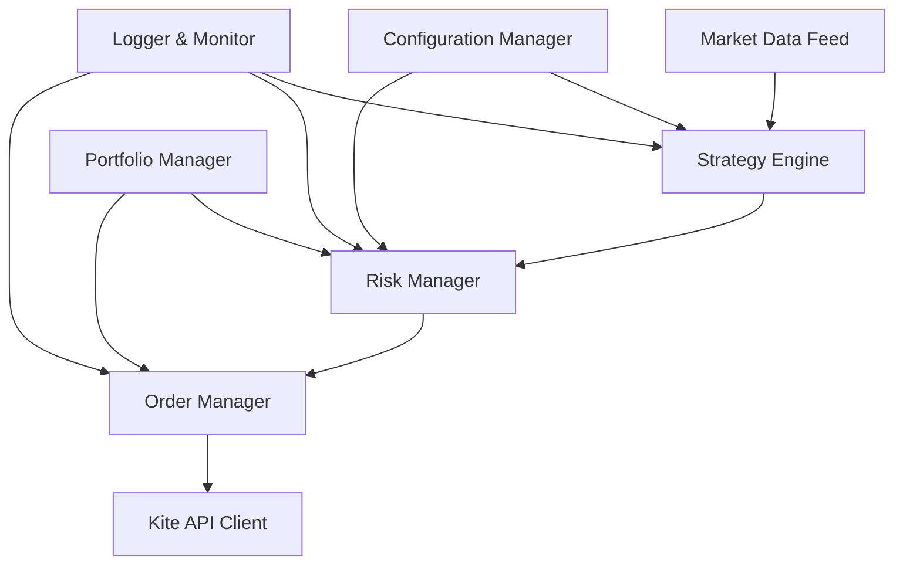

# Design Document

## Overview

The Kite Auto-Trading application is designed as a modular, event-driven system that integrates with Zerodha's Kite Connect API to execute automated trading strategies. The architecture emphasizes reliability, configurability, and risk management while maintaining clean separation of concerns between market data handling, strategy execution, and order management.

## Architecture

The application follows a layered architecture with clear separation between:

- **API Layer**: Handles all Kite Connect API interactions
- **Strategy Engine**: Processes trading logic and decision making  
- **Risk Management**: Enforces trading limits and safety checks
- **Data Management**: Handles market data feeds and persistence
- **Configuration**: Manages application settings and strategy parameters
- **Monitoring**: Provides logging, metrics, and alerting



## Components and Interfaces

### 1. Kite API Client
**Purpose**: Centralized interface for all Kite Connect API operations

**Key Methods**:
- `authenticate(api_key, access_token)`: Handle authentication
- `get_live_data(instruments)`: Fetch real-time market data
- `place_order(order_params)`: Execute trade orders
- `get_positions()`: Retrieve current positions
- `get_funds()`: Check available margin

**Error Handling**: Implements retry logic, rate limiting, and connection management

### 2. Strategy Engine
**Purpose**: Core component that evaluates trading conditions and generates signals

**Key Classes**:
- `StrategyBase`: Abstract base class for all strategies
- `TechnicalStrategy`: Implements technical indicator-based strategies
- `StrategyManager`: Orchestrates multiple strategies

**Key Methods**:
- `evaluate(market_data)`: Process market data and generate signals
- `get_entry_signals()`: Identify buy/sell opportunities
- `get_exit_signals()`: Determine when to close positions

### 3. Risk Manager
**Purpose**: Enforces trading limits and validates all trading decisions

**Key Features**:
- Position sizing based on account balance and risk percentage
- Daily loss limits and maximum drawdown protection
- Per-instrument position limits
- Margin requirement validation

**Key Methods**:
- `validate_order(order)`: Check if order meets risk criteria
- `calculate_position_size(signal, account_balance)`: Determine order quantity
- `check_daily_limits()`: Verify daily trading limits

### 4. Market Data Manager
**Purpose**: Handles real-time data feeds and maintains price history

**Key Features**:
- WebSocket connection management for live data
- Historical data caching for technical analysis
- Data validation and cleaning
- Multiple timeframe support

**Key Methods**:
- `subscribe_instruments(instrument_list)`: Start data feeds
- `get_current_price(instrument)`: Retrieve latest price
- `get_historical_data(instrument, timeframe)`: Access price history

### 5. Order Manager
**Purpose**: Manages order lifecycle and execution tracking

**Key Features**:
- Order queue management
- Execution status tracking
- Partial fill handling
- Order modification and cancellation

**Key Methods**:
- `submit_order(order)`: Queue order for execution
- `track_order_status(order_id)`: Monitor order progress
- `handle_order_update(update)`: Process execution updates

### 6. Portfolio Manager
**Purpose**: Tracks positions, P&L, and portfolio metrics

**Key Features**:
- Real-time position tracking
- P&L calculation including costs
- Performance metrics computation
- Risk exposure monitoring

**Key Methods**:
- `update_position(trade)`: Record new trade
- `calculate_unrealized_pnl()`: Compute current P&L
- `get_portfolio_summary()`: Generate portfolio report

## Data Models

### Strategy Configuration
```python
@dataclass
class StrategyConfig:
    name: str
    enabled: bool
    instruments: List[str]
    entry_conditions: Dict[str, Any]
    exit_conditions: Dict[str, Any]
    risk_params: RiskParameters
    timeframe: str
```

### Order Model
```python
@dataclass
class Order:
    instrument: str
    transaction_type: str  # BUY/SELL
    quantity: int
    order_type: str  # MARKET/LIMIT
    price: Optional[float]
    trigger_price: Optional[float]
    strategy_id: str
    timestamp: datetime
```

### Position Model
```python
@dataclass
class Position:
    instrument: str
    quantity: int
    average_price: float
    current_price: float
    unrealized_pnl: float
    strategy_id: str
    entry_time: datetime
```

### Risk Parameters
```python
@dataclass
class RiskParameters:
    max_position_size: float
    stop_loss_percentage: float
    target_profit_percentage: float
    daily_loss_limit: float
    max_positions_per_instrument: int
```

## Error Handling

### API Error Management
- **Rate Limiting**: Implement exponential backoff for API rate limits
- **Connection Errors**: Automatic reconnection with circuit breaker pattern
- **Authentication Errors**: Graceful re-authentication flow
- **Invalid Orders**: Comprehensive validation before submission

### System Error Recovery
- **Data Feed Interruption**: Fallback to cached data with staleness warnings
- **Strategy Errors**: Isolate failing strategies without affecting others
- **Critical Failures**: Emergency stop mechanism for all trading activities

### Logging Strategy
- **Structured Logging**: JSON format for easy parsing and analysis
- **Log Levels**: DEBUG for development, INFO for operations, ERROR for issues
- **Audit Trail**: Complete record of all trading decisions and executions
- **Performance Metrics**: Regular logging of system performance indicators

## Testing Strategy

### Unit Testing
- **Strategy Logic**: Test all entry/exit conditions with mock data
- **Risk Management**: Validate all risk checks and limit enforcement
- **API Client**: Mock API responses to test error handling
- **Data Processing**: Test market data parsing and validation

### Integration Testing
- **End-to-End Flows**: Test complete trading workflows
- **API Integration**: Test against Kite Connect sandbox environment
- **Configuration Loading**: Validate configuration parsing and validation
- **Error Scenarios**: Test system behavior under various failure conditions

### Performance Testing
- **Latency Testing**: Measure order execution speed
- **Load Testing**: Test system under high market data volume
- **Memory Usage**: Monitor memory consumption during extended runs
- **Concurrent Strategy Testing**: Validate multiple strategy execution

### Risk Testing
- **Backtesting Framework**: Test strategies against historical data
- **Stress Testing**: Validate risk limits under extreme market conditions
- **Scenario Testing**: Test specific market scenarios and edge cases
- **Compliance Testing**: Ensure adherence to trading regulations